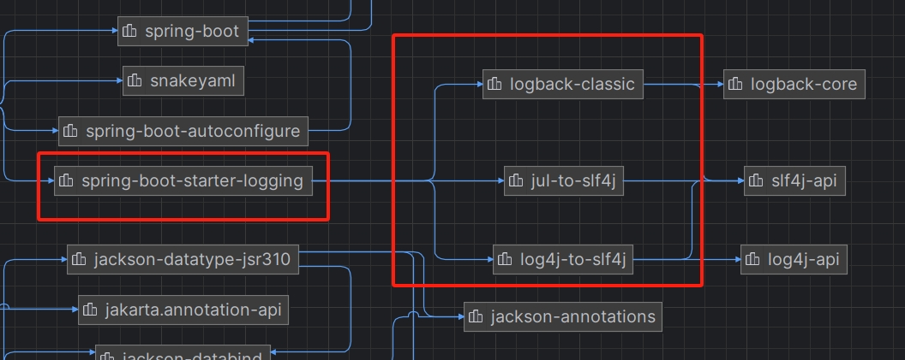

日志使用:门面+框架

门面：

~~JCL~~:Apache的Jakarta Commons Logging:最后更新于14年

~~jboss-logging~~：只用在一些特定框架

SLF4J(Simple Logging Facade for Java):

框架：

~~JUL~~：java.util.logging,Java自带的不推荐

~~Log4j~~(过时)

Logback：log4j作者的另一个日志框架，同时也是slf4j的作者

Log4j2:Apache的项目，对log4j的升级，同时借鉴了logback的优点，虽然先进但未普及

选择：slf4j+logback

SpringBoot中的日志框架：spring默认使用JCL

SpringBoot选择的也是slf4j+logback

slf4j和各类日志实现的使用

图片

slf4j和多个日志实现的使用
图片

排出掉其它日志

引入中间包

引入需要用的日志实现（中间包实际调用这个日志实现）

1.5.9版本的SpringBoot引用的Spring-core中排除了commons-logging

```xml
        <dependency>
            <groupId>org.springframework</groupId>
            <artifactId>spring-core</artifactId>
            <exclusions>
                <exclusion>
                    <groupId>commons-logging</groupId>
                    <artifactId>commons-logging</artifactId>
                </exclusion>
            </exclusions>
        </dependency>
```

SB2.0后使用的Spring5里使用了

```xml
    <dependency>
      <groupId>org.springframework</groupId>
      <artifactId>spring-jcl</artifactId>
      <version>5.1.8.RELEASE</version>
      <scope>compile</scope>
    </dependency>
```




使用：

> Logger logger = LoggerFactory.getLogger(Boot3LoggingApplication.class);
> 
> logger.trace("trace");  
> //但是在main方法里会打印debug日志  
> logger.debug("debug");  
> //SB默认打印info及以上级别的日志  
> logger.info("info");  
> logger.warn("warn");  
> logger.error("error");

> logging.file:指定全路径日志文件名
> 
> logging.path:指定路径 默认spring.log
> 
> logging.level.包名：指定level，没指定默认root